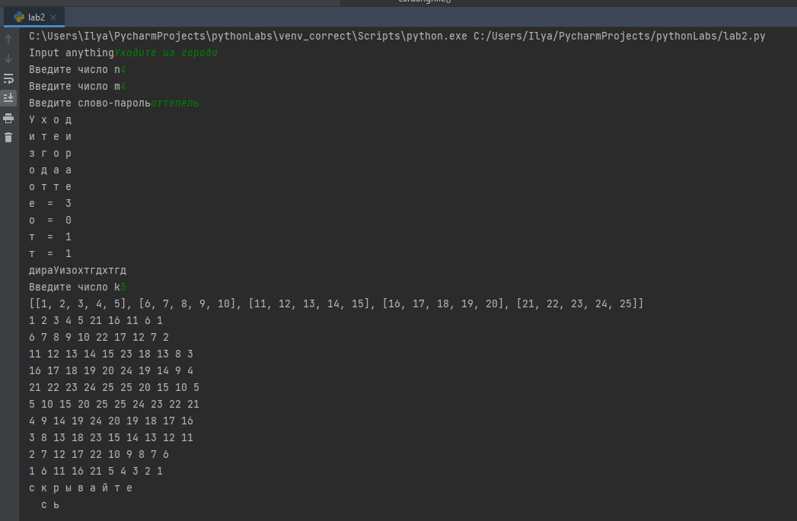

---
# Front matter
title: "Отчёт по лабораторной работе №2"
subtitle: "Шифры перестановки"
author: "Шевляков Илья Николаевич НФИмд-01-21"

# Generic otions
lang: ru-RU
toc-title: "Содержание"

# Bibliography
bibliography: bib/cite.bib
csl: pandoc/csl/gost-r-7-0-5-2008-numeric.csl

# Pdf output format
toc: true # Table of contents
toc_depth: 2
lof: true # List of figures
fontsize: 12pt
linestretch: 1.5
papersize: a4
documentclass: scrreprt
## I18n
polyglossia-lang:
  name: russian
  options:
	- spelling=modern
	- babelshorthands=true
polyglossia-otherlangs:
  name: english
### Fonts
mainfont: PT Serif
romanfont: PT Serif
sansfont: PT Sans
monofont: PT Mono
mainfontoptions: Ligatures=TeX
romanfontoptions: Ligatures=TeX
sansfontoptions: Ligatures=TeX,Scale=MatchLowercase
monofontoptions: Scale=MatchLowercase,Scale=0.9
## Biblatex
biblatex: true
biblio-style: "gost-numeric"
biblatexoptions:
  - parentracker=true
  - backend=biber
  - hyperref=auto
  - language=auto
  - autolang=other*
  - citestyle=gost-numeric
## Misc options
indent: true
header-includes:
  - \linepenalty=10 # the penalty added to the badness of each line within a paragraph (no associated penalty node) Increasing the value makes tex try to have fewer lines in the paragraph.
  - \interlinepenalty=0 # value of the penalty (node) added after each line of a paragraph.
  - \hyphenpenalty=50 # the penalty for line breaking at an automatically inserted hyphen
  - \exhyphenpenalty=50 # the penalty for line breaking at an explicit hyphen
  - \binoppenalty=700 # the penalty for breaking a line at a binary operator
  - \relpenalty=500 # the penalty for breaking a line at a relation
  - \clubpenalty=150 # extra penalty for breaking after first line of a paragraph
  - \widowpenalty=150 # extra penalty for breaking before last line of a paragraph
  - \displaywidowpenalty=50 # extra penalty for breaking before last line before a display math
  - \brokenpenalty=100 # extra penalty for page breaking after a hyphenated line
  - \predisplaypenalty=10000 # penalty for breaking before a display
  - \postdisplaypenalty=0 # penalty for breaking after a display
  - \floatingpenalty = 20000 # penalty for splitting an insertion (can only be split footnote in standard LaTeX)
  - \raggedbottom # or \flushbottom
  - \usepackage{float} # keep figures where there are in the text
  - \floatplacement{figure}{H} # keep figures where there are in the text
---

# Цель работы

Изучение шифров перестановки, а конкретно "Маршрутное шифрование", "Шифрование с помощью решоток" и "Таблица Виженера".

# Теоретические сведения

## Маршрутное шифрование

Шифрование перестановкой заключается в том, что текста переставляются по определенному правилу. 

Простейшим примеров перестановочного шифра являются так называемые «маршрутные перестановки», использующие некоторую геометрическую фигуру (плоскую или объемную). 

Шифрование заключается в том, что текст записывается в такую фигуру по некоторой траектории, а выписывается по другой траектории. 

Пример — маршрутные шифры перестановки, основанные на прямоугольниках (таблицах). 

Шифруемое сообщение в этом случае записывается в прямоугольную таблицу по маршруту: по горизонтали, начиная с верхнего левого угла, поочередно слева направо. 


## Шифрование с помощью решоток

Шифрование с помощью решёток применяется для защиты информации, представляющую ценность в течение ограниченного времени (несколько часов). 

Этот шифр также является перестановочным, т.е. криптограммы этого шифра представляют собой анаграммы открытого текста. 

Данный метод шифрования активно применялся во время второй мировой войны, и до сих пор используется в качестве армейского шифра.

Алгоритм шифрования

1. Выбирается число k. Строим квадрат со стороной длины k и заполняем его клетки числами от 1 до k^2
2. Поворачиваем квадрат на 90 градус по часовой стрелке и приписываем справа от исходного квадрата
3. Поворачивая на 90 градусов по часовой стрелки и добавляя полученный квадрат сначала снизу, а затем слева от предыдущего, получим следующий квадрат со стороной 2k
4. В этом квадрате закрасим произвольным образом все цифры, причем каждая цифра может быть закрашена только один раз.

Это и будет решёткой для шифрования.

## Таблица Виженера

Шифр Виженера состоит из последовательности нескольких шифров Цезаря с различными значениями сдвига. 

Для зашифровывания может использоваться таблица алфавитов, называемая tabula recta или квадрат (таблица) Виженера. 

Применительно к латинскому алфавиту таблица Виженера составляется из строк по 26 символов, причём каждая следующая строка сдвигается на несколько позиций. 

Таким образом, в таблице получается 26 различных шифров Цезаря. 

На каждом этапе шифрования используются различные алфавиты, выбираемые в зависимости от символа ключевого слова.

# Выполнение работы

## Реализация маршрутного шифрования, шифрования с помощью решоток и таблицы Виженера на языке Python


```
import sys


def prrint(lists):
    for i in lists:
        for j in i:
            print(j, end=" ")
        print()


def marhsrutshifr():
    text = input("Input anything").replace(' ', '')
    n = int(input("Введите число n"))
    m = int(input("Введите число m"))
    parol = input("Введите слово-пароль")

    lists = [['a' for i in range(0, n)] for j in range(m)]
    it = 0
    for i in range(m):
        for j in range(n):
            if it < len(text):
                lists[i][j] = text[it]
                it += 1
    lis = list()
    for i in range(n):
        lis.append(parol[i])
    lists.append(lis)
    prrint(lists)
    result = ""
    spisok = sorted(lists[len(lists) - 1])
    for i in spisok:
        print(i, " = ", lists[len(lists) - 1].index(i))
        for j in range(len(lists)):
            if j == len(lists) - 1:
                continue
            result += lists[j][lists[len(lists) - 1].index(i)]
    print(result)


def rot90(matrix):
    return [list(reversed(col)) for col in zip(*matrix)]


def udalenie(largelist, inn, k):
    for i in range(k * 2):
        for j in range(k * 2):
            if largelist[i][j] == inn:
                largelist[i][j] = " "
                return


def cardangrille():  # второе задания
    k = int(input("Введите число k"))
    s = 1
    lists = [[i for i in range(k)] for i in range(k)]
    for i in range(k):
        for j in range(k):
            lists[i][j] = s
            s += 1
    print(lists)
    lists1 = rot90(lists)
    lists2 = rot90(lists1)
    lists3 = rot90(lists2)
    largelist = [[1 for i in range(2 * k)] for i in range(2 * k)]
    for i in range(k):
        for j in range(k):
            largelist[i][j] = lists[i][j]
    i1 = 0
    j1 = 0
    for i in range(0, k):
        for j in range(k, k * 2):
            largelist[i][j] = lists1[i1][j1]
            j1 += 1
        j1 = 0
        i1 += 1
    i1 = 0
    j1 = 0
    for i in range(k, k * 2):
        for j in range(k, k * 2):
            largelist[i][j] = lists2[i1][j1]
            j1 += 1
        j1 = 0
        i1 += 1
    i1 = 0
    j1 = 0
    for i in range(k, k * 2):
        for j in range(0, k):
            largelist[i][j] = lists3[i1][j1]
            j1 += 1
        j1 = 0
        i1 += 1
    prrint(largelist)
    text = "договорподписали"
    largelist_a = [[" " for i in range(2 * k)] for i in range(2 * k)]
    s = 0
    li = [i for i in range(1, k ** 2 + 1)]
    for inn in li:
        udalenie(largelist, inn, k)
    ind = 0
    for i in range(k * 2):
        for j in range(k * 2):
            if largelist[i][j] == largelist_a[i][j] and len(text) > 0:
                largelist_a[i][j] = text[0]
                text = text[1:]
    largelist = rot90(largelist)
    for i in range(k * 2):
        for j in range(k * 2):
            if largelist[i][j] == largelist_a[i][j] and len(text) > 0:
                largelist_a[i][j] = text[0]
                text = text[1:]
    if len(text) > 0:
        largelist = rot90(largelist)
        for i in range(k * 2):
            for j in range(k * 2):
                if largelist[i][j] == largelist_a[i][j] and len(text) > 0:
                    largelist_a[i][j] = text[0]
                    text = text[1:]
    if len(text) > 0:
        largelist = rot90(largelist)
        for i in range(k * 2):
            for j in range(k * 2):
                if largelist[i][j] == largelist_a[i][j] and len(text) > 0:
                    largelist_a[i][j] = text[0]
                    text = text[1:]
    prrint(largelist_a)
    stri = input("Введите пароль")
    if len(stri) > k * 2:
        stri = stri[:k * 2]
    elif len(stri) < k * 2:
        while len(stri) != k * 2:
            stri += "z"
    largelist_a.append(list(stri))
    prrint(largelist_a)
    result = ""
    spisok = sorted(largelist_a[len(largelist_a) - 1])
    for i in spisok:
        print(i, " = ", largelist_a[len(largelist_a) - 1].index(i))
        for j in range(len(largelist_a)):
            if j == len(largelist_a) - 1:
                continue
            result += largelist_a[j][largelist_a[len(largelist_a) - 1].index(i)]
    print(result.replace(" ", ""))


def form_dict():
    d = {}
    iter = 0
    for i in range(0, 127):
        d[iter] = chr(i)
        iter = iter + 1
    return d


def encode_val(word):
    list_code = []
    lent = len(word)
    d = form_dict()

    for w in range(lent):
        for value in d:
            if word[w] == d[value]:
                list_code.append(value)
    return list_code


def comparator(value, key):
    len_key = len(key)
    dic = {}
    iter = 0
    full = 0

    for i in value:
        dic[full] = [i, key[iter]]
        full = full + 1
        iter = iter + 1
        if (iter >= len_key):
            iter = 0
    return dic


def full_encode(value, key):
    dic = comparator(value, key)
    print('Compare full encode', dic)
    lis = []
    d = form_dict()

    for v in dic:
        go = (dic[v][0] + dic[v][1]) % len(d)
        lis.append(go)
    return lis


def decode_val(list_in):
    list_code = []
    lent = len(list_in)
    d = form_dict()

    for i in range(lent):
        for value in d:
            if list_in[i] == value:
                list_code.append(d[value])
    return list_code


def full_decode(value, key):
    dic = comparator(value, key)
    print('Deshifre=', dic)
    d = form_dict()
    lis = []

    for v in dic:
        go = (dic[v][0] - dic[v][1] + len(d)) % len(d)
        lis.append(go)
    return lis


def vijer():
    word = "Test sent"
    key = "just"
    sys.stdout.write(word)
    sys.stdout.write(key)
    key_encoded = encode_val(key)
    value_encoded = encode_val(word)
    sys.stdout.write(str(key_encoded))
    sys.stdout.write(str(value_encoded))
    shifre = full_encode(value_encoded, key_encoded)
    print('Шифр=', ''.join(decode_val(shifre)))

    decoded = full_decode(shifre, key_encoded)
    print('Decode list=', decoded)
    decode_word_list = decode_val(decoded)
    print('Word=', ''.join(decode_word_list))


marhsrutshifr()

cardangrille()

vijer()

```


## Контрольный пример

{ #fig:001 width=100% height=100%}
{ #fig:002 width=100% height=100%}

# Выводы

Во время выполнения данной лабораторной работы были изучили шифры перестановки, а конкретно "Маршрутное шифрование", "Шифрование с помощью решоток" и "Таблица Виженера". 


# Список литературы{.unnumbered}

1. [Маршрутное шифрование](https://ru.wikipedia.org/wiki/%D0%9F%D0%B5%D1%80%D0%B5%D1%81%D1%82%D0%B0%D0%BD%D0%BE%D0%B2%D0%BE%D1%87%D0%BD%D1%8B%D0%B9_%D1%88%D0%B8%D1%84%D1%80)
2. [Шифрование с помощью решоток](https://kabinfo.ucoz.ru/index/shifr_reshetka_kardano/0-374#:~:text=%D0%A8%D0%B8%D1%84%D1%80%D0%BE%D0%B2%D0%B0%D0%BD%D0%B8%D0%B5%20%D1%81%20%D0%BF%D0%BE%D0%BC%D0%BE%D1%89%D1%8C%D1%8E%20%D1%80%D0%B5%D1%88%D1%91%D1%82%D0%BE%D0%BA%20%D0%BF%D1%80%D0%B8%D0%BC%D0%B5%D0%BD%D1%8F%D0%B5%D1%82%D1%81%D1%8F,%D0%B5.&text=%D0%94%D0%B0%D0%BD%D0%BD%D1%8B%D0%B9%20%D0%BC%D0%B5%D1%82%D0%BE%D0%B4%20%D1%88%D0%B8%D1%84%D1%80%D0%BE%D0%B2%D0%B0%D0%BD%D0%B8%D1%8F%20%D0%B0%D0%BA%D1%82%D0%B8%D0%B2%D0%BD%D0%BE%20%D0%BF%D1%80%D0%B8%D0%BC%D0%B5%D0%BD%D1%8F%D0%BB%D1%81%D1%8F,%D0%B8%D1%81%D0%BF%D0%BE%D0%BB%D1%8C%D0%B7%D1%83%D0%B5%D1%82%D1%81%D1%8F%20%D0%B2%20%D0%BA%D0%B0%D1%87%D0%B5%D1%81%D1%82%D0%B2%D0%B5%20%D0%B0%D1%80%D0%BC%D0%B5%D0%B9%D1%81%D0%BA%D0%BE%D0%B3%D0%BE%20%D1%88%D0%B8%D1%84%D1%80%D0%B0.)
3. [Таблица Виженера](https://ru.wikipedia.org/wiki/%D0%A8%D0%B8%D1%84%D1%80_%D0%92%D0%B8%D0%B6%D0%B5%D0%BD%D0%B5%D1%80%D0%B0)