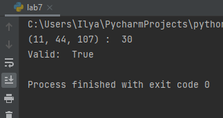

---
# Front matter
title: "Отчёт по лабораторной работе №7"
subtitle: "Дискретное логарифмирование"
author: "Шевляков Илья Николаевич НФИмд-01-21"

# Generic otions
lang: ru-RU
toc-title: "Содержание"

# Bibliography
bibliography: bib/cite.bib
csl: pandoc/csl/gost-r-7-0-5-2008-numeric.csl

# Pdf output format
toc: true # Table of contents
toc_depth: 2
lof: true # List of figures
fontsize: 12pt
linestretch: 1.5
papersize: a4
documentclass: scrreprt
## I18n
polyglossia-lang:
  name: russian
  options:
	- spelling=modern
	- babelshorthands=true
polyglossia-otherlangs:
  name: english
### Fonts
mainfont: PT Serif
romanfont: PT Serif
sansfont: PT Sans
monofont: PT Mono
mainfontoptions: Ligatures=TeX
romanfontoptions: Ligatures=TeX
sansfontoptions: Ligatures=TeX,Scale=MatchLowercase
monofontoptions: Scale=MatchLowercase,Scale=0.9
## Biblatex
biblatex: true
biblio-style: "gost-numeric"
biblatexoptions:
  - parentracker=true
  - backend=biber
  - hyperref=auto
  - language=auto
  - autolang=other*
  - citestyle=gost-numeric
## Misc options
indent: true
header-includes:
  - \linepenalty=10 # the penalty added to the badness of each line within a paragraph (no associated penalty node) Increasing the value makes tex try to have fewer lines in the paragraph.
  - \interlinepenalty=0 # value of the penalty (node) added after each line of a paragraph.
  - \hyphenpenalty=50 # the penalty for line breaking at an automatically inserted hyphen
  - \exhyphenpenalty=50 # the penalty for line breaking at an explicit hyphen
  - \binoppenalty=700 # the penalty for breaking a line at a binary operator
  - \relpenalty=500 # the penalty for breaking a line at a relation
  - \clubpenalty=150 # extra penalty for breaking after first line of a paragraph
  - \widowpenalty=150 # extra penalty for breaking before last line of a paragraph
  - \displaywidowpenalty=50 # extra penalty for breaking before last line before a display math
  - \brokenpenalty=100 # extra penalty for page breaking after a hyphenated line
  - \predisplaypenalty=10000 # penalty for breaking before a display
  - \postdisplaypenalty=0 # penalty for breaking after a display
  - \floatingpenalty = 20000 # penalty for splitting an insertion (can only be split footnote in standard LaTeX)
  - \raggedbottom # or \flushbottom
  - \usepackage{float} # keep figures where there are in the text
  - \floatplacement{figure}{H} # keep figures where there are in the text
---

# Цель работы

Изучение задачи дискретного логарифмирования.

# Теоретические сведения

Пусть в некоторой конечной мультипликативной абелевой группе $G$ задано уравнение

$$g^x=a$$

Решение задачи дискретного логарифмирования состоит в нахождении некоторого целого неотрицательного числа $x$, удовлетворяющего уравнению. Если оно разрешимо, у него должно быть хотя бы одно натуральное решение, не превышающее порядок группы.
Это сразу даёт грубую оценку сложности алгоритма поиска решений сверху — алгоритм полного перебора нашёл бы решение за число шагов не выше порядка данной группы.

Чаще всего рассматривается случай, когда группа является циклической, порождённой элементом $g$.
В этом случае уравнение всегда имеет решение. 
В случае же произвольной группы вопрос о разрешимости задачи дискретного логарифмирования, то есть вопрос о существовании решений уравнения , требует отдельного рассмотрения.

## p-алгоритм Поллрада

* Вход. Простое число $p$, число $a$ порядка $r$ по модулю $p$, целое число $b$б $1 < b < p$; отображение $f$, обладающее сжимающими свойствами и сохраняющее вычислимость логарифма.
* Выход. показатель $x$, для которого $a^x=b(mod p)$, если такой показатель существует.

1. Выбрать произвольные целые числа $u, v$ и положить $c=a^u b^v (mod p), d=c$
2. Выполнять $c=f(c)(mod p), d=f(f(d))(mod p), вычисляя при этом логарифмы для $c$ и $d$ как линейные функции от $x$ по модулю $r$, до получения равенства $c=d (mod p)$
3. Приняв логарифмы для $c$ и $d$, вычислить логарифм $x$ решением сравнения по модулю $r$. Результат $x$ или РЕШЕНИЯ НЕТ.

# Выполнение работы

## Реализация алгоритма на языке Python

```
def euclid(a, b):
    if b == 0:
        return a, 1, 0
    else:
        d, xx, yy = euclid(b, a % b)
        x = yy
        y = xx - (a // b) * yy
        return d, x, y


def inver(a, n):
    return euclid(a, n)[1]


def pol_ab(x, a, b, todochan):
    (G, H, P, Q) = todochan
    sub = x % 3
    if sub == 0:
        x = x * todochan[0] % todochan[2]
        a = (a + 1) % Q
    if sub == 1:
        x = x * todochan[1] % todochan[2]
        b = (b + 1) % todochan[2]
    if sub == 2:
        x = x * x % todochan[2]
        a = a * 2 % todochan[3]
        b = b * 2 % todochan[3]
    return x, a, b


def pollrad(G, H, P):
    Q = int((P - 1) // 2)
    x = G * H
    a = 1
    b = 1
    X = x
    A = a
    B = b
    for i in range(1, P):
        x, a, b = pol_ab(x, a, b, (G, H, P, Q))
        X, A, B = pol_ab(X, A, B, (G, H, P, Q))
        X, A, B = pol_ab(X, A, B, (G, H, P, Q))
        if x == X:
            break
    nom = a - A
    denom = B - b
    res = (inver(denom, Q) * nom) % Q
    if ver(G, H, P, res):
        return res


def ver(g, h, p, x):
    return pow(g, x, p) == h

def lab7():
    args = [
        (11, 44, 107),
    ]
    for arg in args:
        res = pollrad(*arg)
        print(arg, ': ', res)
        print('Valid: ', ver(arg[0], arg[1], arg[2], res), end='\n')

lab7()
```

## Контрольный пример

{ #fig:001 }

# Выводы

Изучили задачу дискретного логарифмирования.

# Список литературы{.unnumbered}

1. [Дискретное логарифмирование](https://math.fandom.com/ru/wiki/%D0%94%D0%B8%D1%81%D0%BA%D1%80%D0%B5%D1%82%D0%BD%D0%BE%D0%B5_%D0%BB%D0%BE%D0%B3%D0%B0%D1%80%D0%B8%D1%84%D0%BC%D0%B8%D1%80%D0%BE%D0%B2%D0%B0%D0%BD%D0%B8%D0%B5)
2. [Как работает криптография на основе эллиптических кривых](https://blog.qrator.net/ru/ec-tls-13_60/)